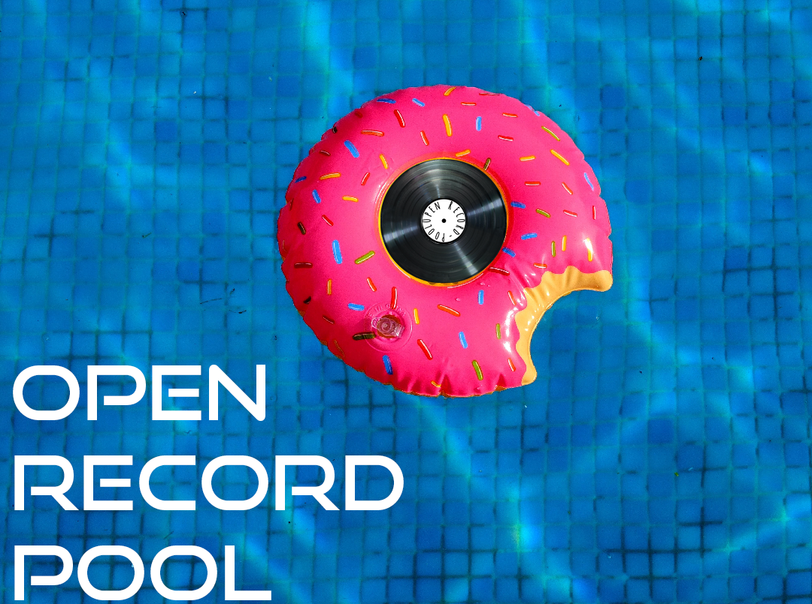

**Open-Record-Pool**

Open-Record-Pool is a self-hosted open-source web app that allows users and more importantly DJs with large collections to keep track of their library in a structured manner. This tool can be used to dynamically create playlists using Spotify’s API, manage song metadata with the help of PuddleTag, manage user’s access to your library but also share your playlists with others.

**Getting Started**

- [Download/Installation](https://github.com/walachewaka/open-record-pool/blob/dev/INSTALL.md)
- Donate

**Features**

- Analyze ID3 metadata from specified music library
- Edit ID3 metadata from individual tracks or batches
- Built-in file manager
- Rapid indexing & search reaults with ElasticSearch
- Built-in web player
- Filter results by BPM, Genre, Album, Key, Artist, Date Added, Remix vs Original
- Automatic detection of new additions to collection
- Simple import management for new tracks
- Individual song downloads & batch downloads
- History section to keep track of previously downloaded songs
- Create personal playlists or public playlists to share with others
- Export playlists as M3U
- Dynamic playlists based of Spotify’s API – auto populate playlists with songs from personal collection to match those of Spotify’s
- AI generated playlists based off user listening history
- Statistics for songs; listening time, times played, most downloaded, liked, shared, least listened to
- Simple UI
- Quick installation through Docker-Compose

**License**

- [GNU GPL v3](http://www.gnu.org/licenses/gpl-3.0.html)
